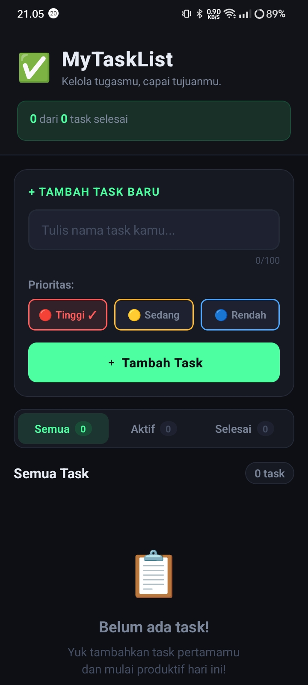
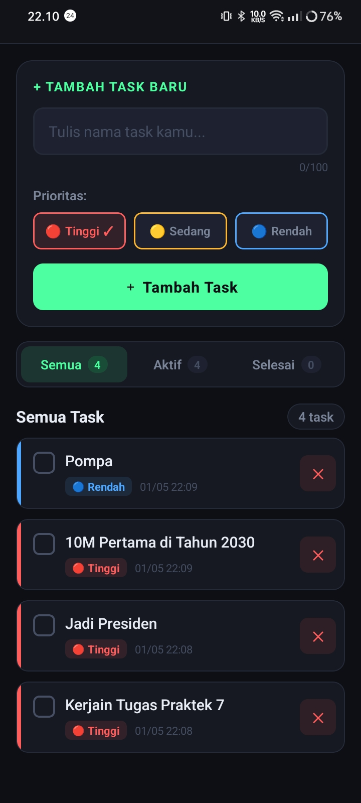
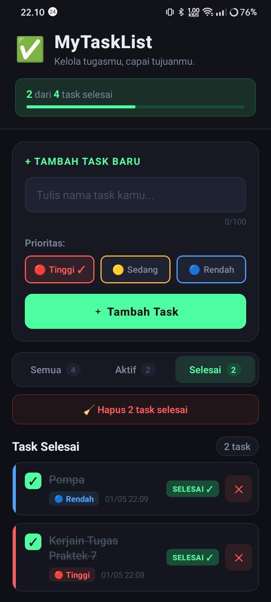

# ✅ MyTaskList App
### Mini Project P07 — Mobile Programming Practicum

---

## 👤 Identitas Mahasiswa

| Field | Detail |
|---|---|
| **Nama** | Eykel Agitha Kembaren |
| **NIM** | 243303621275 |
| **Program Studi** | Sistem Informasi |
| **Mata Kuliah** | Praktek Pemrograman Mobile (React Native) |
| **Pertemuan** | 7 — Mini Project Integrasi P01–P06 |

---

## 📱 Deskripsi Aplikasi

**MyTaskList** adalah aplikasi task manager modern bertema dark productivity yang memungkinkan pengguna mengelola tugas sehari-hari secara efisien. Aplikasi ini mendukung penambahan task dengan sistem prioritas tiga tingkat (Tinggi/Sedang/Rendah), fitur mark as done, filter view, dan progress tracker — semuanya dalam antarmuka yang bersih, responsif, dan profesional.

---

## ✅ Fitur yang Diimplementasikan

### Requirement Wajib
- [x] **Setup & Running di HP Fisik** — App berjalan via Expo Go (QR Code scan)
- [x] **Komponen Dasar P02 & P03** — `View`, `Text`, `TouchableOpacity`, `StyleSheet.create`, Flexbox
- [x] **State Management useState P04** — 2 state utama (`tasks[]`, `activeFilter`) + conditional rendering
- [x] **Form Input & Validasi P05** — `TextInput`, `KeyboardAvoidingView`, validasi 3 kondisi + animasi shake
- [x] **FlatList & Empty State P06** — `FlatList`, `keyExtractor`, `ListEmptyComponent` kontekstual
- [x] **CRUD Minimal** — Add ➕ dan Delete 🗑️ task

### Fitur Bonus (+35 Poin)
- [x] ⭐ **Mark as Done** (+5) — Centang task selesai dengan checkbox interaktif + strikethrough text
- [x] ⭐ **Prioritas Task** (+5) — Tinggi/Sedang/Rendah dengan warna merah/kuning/biru
- [x] ⭐ **Counter Task Selesai** (+5) — "X dari Y task selesai" + progress bar visual
- [x] ⭐ **Filter View** (+5) — Semua / Aktif / Selesai dengan badge counter
- [x] ⭐ **UI Rapi & Profesional** (+10) — Dark theme konsisten, animasi masuk/keluar, komponen terstruktur

---

## 🏗️ Struktur Project

```
MyTaskList-App/
├── .gitignore 
├── App.js                    # Root component, state management, FlatList
├── app.json                  # Expo configuration
├── index.js
├── package-lock.json
├── package.json
├── README.md
├── components/
│   ├── Header.js             # Header + progress counter
│   ├── TaskInput.js          # Form input + validasi + priority picker
│   ├── FilterBar.js          # Filter Semua/Aktif/Selesai
│   ├── TaskItem.js           # Card task individual + animasi
│   └── EmptyState.js         # Empty state kontekstual per filter
└── constants/
    └── theme.js              # Warna, tema, konfigurasi prioritas
```

---

## 🎨 Desain & Tema

**Dark Productivity Theme**
- Background: `#0D0F14` (near-black)
- Aksen: `#4DFFA0` (neon green-teal)
- Prioritas Tinggi: `#FF5C5C` (merah)
- Prioritas Sedang: `#FFB830` (kuning)
- Prioritas Rendah: `#4DA6FF` (biru)

---

## 📸 Screenshot App di HP Fisik

| Home | Add Task | Filter |
|------|----------|--------|
|  |  |  |

---

## 🚀 Cara Menjalankan Project

### Prerequisite
- Node.js ≥ 18 terinstall
- Expo Go terinstall di HP fisik (iOS / Android)

### Langkah-langkah

```bash
# 1. Clone repository
git clone https://github.com/[username]/MyTaskList-App.git
cd MyTaskList-App

# 2. Install dependencies
npm install

# 3. Jalankan development server
npx expo start

# 4. Scan QR Code yang muncul di terminal menggunakan:
#    - Android: Expo Go app → Scan QR Code
#    - iOS: Kamera bawaan → Scan QR Code
```

---

## 🔗 Links

| Platform | Link |
|---|---|
| **GitHub** | https://github.com/[username]/MyTaskList-App |
| **Expo Snack** | *(tambahkan link Expo Snack setelah deploy)* |

---

## 📖 Konsep yang Dipelajari (P01–P06)

| Pertemuan | Konsep | Implementasi di App |
|---|---|---|
| P01 | Setup Expo | `npx create-expo-app`, Expo Go |
| P02 | Komponen Dasar | `View`, `Text`, `TouchableOpacity`, `StatusBar` |
| P03 | Layout & StyleSheet | `StyleSheet.create`, Flexbox, `gap`, `borderRadius` |
| P04 | State Management | `useState`, `useMemo`, `useCallback`, conditional render |
| P05 | Form & Validasi | `TextInput`, `KeyboardAvoidingView`, `Alert`, animasi shake |
| P06 | FlatList | `FlatList`, `keyExtractor`, `ListEmptyComponent`, `renderItem` |

---

## 💡 Catatan Teknis

- Seluruh styling menggunakan `StyleSheet.create` — tidak ada inline style
- State lifting dilakukan dari komponen child ke `App.js` via callback props
- `useMemo` digunakan untuk computed values (filtered tasks, counts) agar performa optimal
- `useCallback` digunakan pada handler untuk mencegah re-render unnecessary
- Animasi menggunakan `Animated` API bawaan React Native (tanpa library eksternal)
- `Alert` digunakan untuk konfirmasi delete (UX yang baik)

---

*Dibuat dengan ❤️ oleh Eykel Agitha Kembaren — Sistem Informasi*
